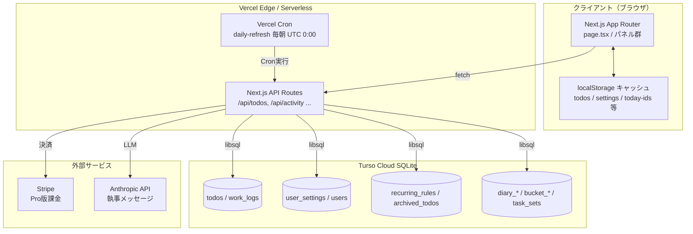

# アーキテクチャ概要

## 全体構成



## レイヤー構成

| 層 | 技術 | 責務 |
|---|---|---|
| **UI** | React / Next.js App Router | タスク表示・入力・編集、ドラッグ操作、タブ切替 |
| **状態管理** | useState / useRef / useMemo | ローカル状態、FLIPアニメーション、ドラッグ状態 |
| **永続化（ローカル）** | localStorage | 初期表示の高速化、日単位の選択状態保持 |
| **API** | Next.js Route Handlers | REST風エンドポイント、認証、CRUD |
| **DB** | Turso (libsql) | ユーザーデータの永続化 |
| **バッチ** | Vercel Cron | 日次リフレッシュ（繰り返し生成・アーカイブ） |

## ディレクトリ構成

```
src/
├── app/
│   ├── page.tsx                  # メインコンポーネント（認証+TodoApp）
│   ├── AppHeader.tsx             # ヘッダー+ハンバーガーメニュー
│   ├── TaskAddForm.tsx           # タスク追加フォーム（共通）
│   ├── RecurrenceSelector.tsx    # 繰り返し設定UI（共通）
│   ├── PomodoroTimer.tsx         # ポモドーロ/ストップウォッチ
│   ├── ButlerAvatar.tsx          # 執事キャラクター
│   ├── SharedComponents.tsx      # DragHandle, DeleteButton, Pagination
│   │
│   ├── TodayPanel.tsx            # 今日やること + タイムブロック
│   ├── CalendarPanel.tsx         # カレンダー
│   ├── TaskSetPanel.tsx          # タスクセット
│   ├── MatrixPanel.tsx           # アイゼンハワーマトリクス（Pro）
│   ├── GtdPanel.tsx              # GTD振り分け
│   ├── TimeBlockPanel.tsx        # タイムブロッキング
│   ├── RecurringPanel.tsx        # 繰り返しルール
│   ├── ActivityPanel.tsx         # 作業記録
│   ├── AnalyticsPanel.tsx        # 分析（見積精度/バーンダウン/週次）
│   ├── CategoryStatsPanel.tsx    # カテゴリ別実績
│   ├── DiaryWritePanel.tsx       # 日記を書く
│   ├── DiaryViewPanel.tsx        # 日記を見る
│   ├── PublicDiaryPanel.tsx      # みんなの日記（Pro）
│   ├── BucketListPanel.tsx       # やりたいことリスト
│   ├── ArchivedTodosPanel.tsx    # 削除したタスク
│   ├── MyPage.tsx                # マイページ
│   ├── SettingsPanel.tsx         # 設定
│   ├── HelpPanel.tsx             # ヘルプ
│   ├── BugReportPanel.tsx        # バグ報告
│   ├── AdminPanel.tsx            # 管理者ダッシュボード
│   │
│   ├── types.ts                  # 型定義（Todo, UserSettings, AppUser 等）
│   ├── utils.ts                  # ユーティリティ関数
│   ├── useIsMobile.ts            # モバイル判定
│   ├── welcomeMessages.ts        # Welcomeメッセージ文言
│   │
│   └── api/
│       ├── init/route.ts         # 初期一括取得
│       ├── auth/**/route.ts      # 認証（login/register/forgot/reset）
│       ├── todos/**/route.ts     # タスクCRUD + logs + archive + recurring + refresh
│       ├── settings/route.ts     # 設定
│       ├── todo-categories/...   # カテゴリ
│       ├── task-sets/...         # タスクセット
│       ├── activity/route.ts     # 作業記録統合
│       ├── analytics/route.ts    # 分析データ
│       ├── diary/...             # 日記
│       ├── matrix/route.ts       # マトリクス配置
│       ├── bucket-list/...       # やりたいことリスト
│       ├── butler/route.ts       # 執事メッセージ（Claude API）
│       ├── bug-reports/route.ts  # バグ報告
│       ├── purchase/...          # Stripe決済
│       └── cron/daily-refresh    # Vercel Cron
│
└── lib/
    ├── db.ts                     # Turso接続 + テーブル初期化 + マイグレーション + インデックス
    ├── refresh.ts                # 日次リフレッシュロジック（共通）
    └── recurrence.ts             # 繰り返し設定の定数・ユーティリティ
```
