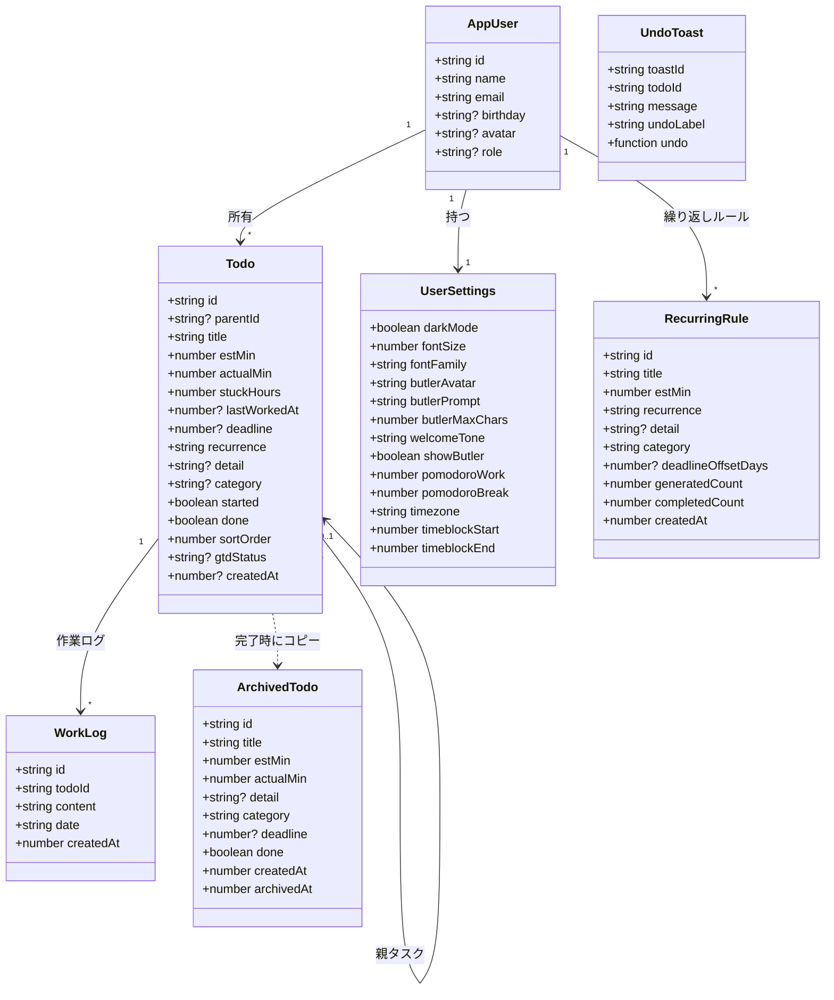
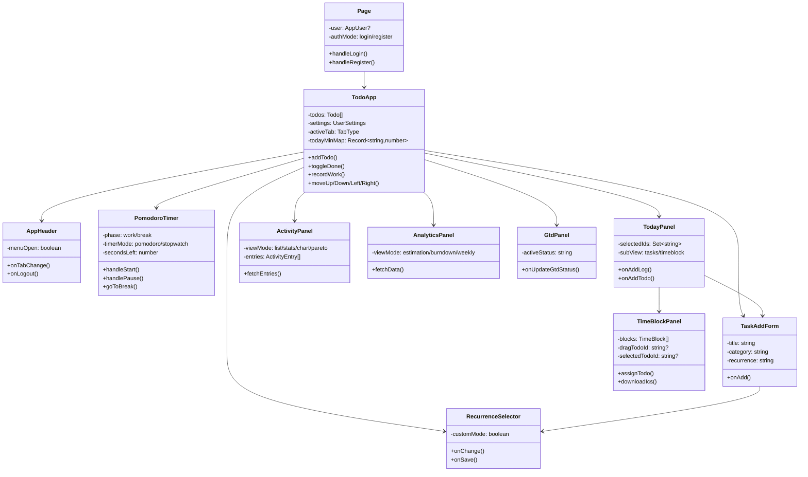
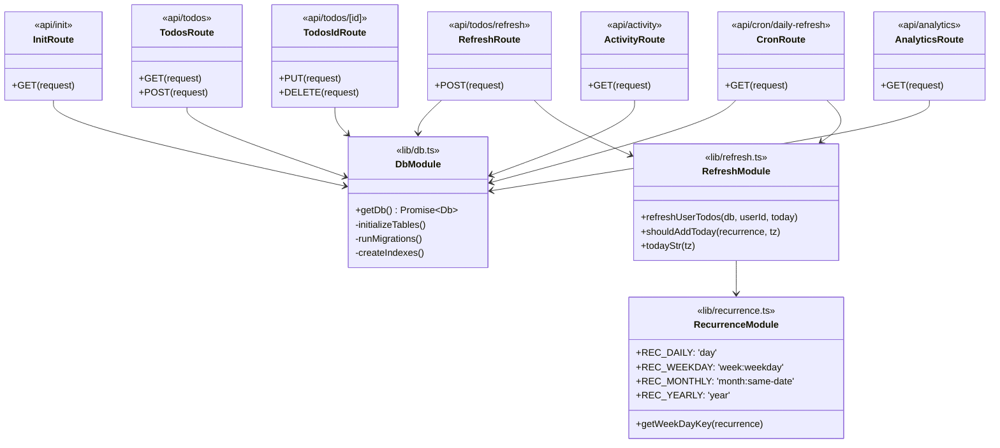

# クラス・モジュール図

## データモデル（型定義）

```mermaid
classDiagram
    class AppUser {
        +string id
        +string name
        +string email
        +string? birthday
        +string? avatar
        +string? role
    }

    class Todo {
        +string id
        +string? parentId
        +string title
        +number estMin
        +number actualMin
        +number stuckHours
        +number? lastWorkedAt
        +number? deadline
        +string recurrence
        +string? detail
        +string? category
        +boolean started
        +boolean done
        +number sortOrder
        +string? gtdStatus
        +number? createdAt
    }

    class UserSettings {
        +boolean darkMode
        +number fontSize
        +string fontFamily
        +string butlerAvatar
        +string butlerPrompt
        +number butlerMaxChars
        +string welcomeTone
        +boolean showButler
        +number pomodoroWork
        +number pomodoroBreak
        +string timezone
        +number timeblockStart
        +number timeblockEnd
    }

    class WorkLog {
        +string id
        +string todoId
        +string content
        +string date
        +number createdAt
    }

    class ArchivedTodo {
        +string id
        +string title
        +number estMin
        +number actualMin
        +string? detail
        +string category
        +number? deadline
        +boolean done
        +number createdAt
        +number archivedAt
    }

    class RecurringRule {
        +string id
        +string title
        +number estMin
        +string recurrence
        +string? detail
        +string category
        +number? deadlineOffsetDays
        +number generatedCount
        +number completedCount
        +number createdAt
    }

    class UndoToast {
        +string toastId
        +string todoId
        +string message
        +string undoLabel
        +function undo
    }

    AppUser "1" --> "*" Todo : 所有
    AppUser "1" --> "1" UserSettings : 持つ
    Todo "1" --> "*" WorkLog : 作業ログ
    Todo "1" --> "0..1" Todo : 親タスク
    Todo ..> ArchivedTodo : 完了時にコピー
    AppUser "1" --> "*" RecurringRule : 繰り返しルール
```

## コンポーネント依存関係

```mermaid
classDiagram
    class Page {
        -user: AppUser?
        -authMode: login/register
        +handleLogin()
        +handleRegister()
    }

    class TodoApp {
        -todos: Todo[]
        -settings: UserSettings
        -activeTab: TabType
        -todayMinMap: Record~string,number~
        +addTodo()
        +toggleDone()
        +recordWork()
        +moveUp/Down/Left/Right()
    }

    class AppHeader {
        -menuOpen: boolean
        +onTabChange()
        +onLogout()
    }

    class TaskAddForm {
        -title: string
        -category: string
        -recurrence: string
        +onAdd()
    }

    class RecurrenceSelector {
        -customMode: boolean
        +onChange()
        +onSave()
    }

    class PomodoroTimer {
        -phase: work/break
        -timerMode: pomodoro/stopwatch
        -secondsLeft: number
        +handleStart()
        +handlePause()
        +goToBreak()
    }

    class TodayPanel {
        -selectedIds: Set~string~
        -subView: tasks/timeblock
        +onAddLog()
        +onAddTodo()
    }

    class TimeBlockPanel {
        -blocks: TimeBlock[]
        -dragTodoId: string?
        -selectedTodoId: string?
        +assignTodo()
        +downloadIcs()
    }

    class ActivityPanel {
        -viewMode: list/stats/chart/pareto
        -entries: ActivityEntry[]
        +fetchEntries()
    }

    class AnalyticsPanel {
        -viewMode: estimation/burndown/weekly
        +fetchData()
    }

    class GtdPanel {
        -activeStatus: string
        +onUpdateGtdStatus()
    }

    Page --> TodoApp
    TodoApp --> AppHeader
    TodoApp --> TaskAddForm
    TodoApp --> RecurrenceSelector
    TodoApp --> PomodoroTimer
    TodoApp --> TodayPanel
    TodoApp --> ActivityPanel
    TodoApp --> AnalyticsPanel
    TodoApp --> GtdPanel
    TaskAddForm --> RecurrenceSelector
    TodayPanel --> TimeBlockPanel
    TodayPanel --> TaskAddForm
```

## APIとライブラリの関係

```mermaid
classDiagram
    class DbModule {
        <<lib/db.ts>>
        +getDb() Promise~Db~
        -initializeTables()
        -runMigrations()
        -createIndexes()
    }

    class RefreshModule {
        <<lib/refresh.ts>>
        +refreshUserTodos(db, userId, today)
        +shouldAddToday(recurrence, tz)
        +todayStr(tz)
    }

    class RecurrenceModule {
        <<lib/recurrence.ts>>
        +REC_DAILY: 'day'
        +REC_WEEKDAY: 'week:weekday'
        +REC_MONTHLY: 'month:same-date'
        +REC_YEARLY: 'year'
        +getWeekDayKey(recurrence)
    }

    class InitRoute {
        <<api/init>>
        +GET(request)
    }

    class TodosRoute {
        <<api/todos>>
        +GET(request)
        +POST(request)
    }

    class TodosIdRoute {
        <<api/todos/[id]>>
        +PUT(request)
        +DELETE(request)
    }

    class RefreshRoute {
        <<api/todos/refresh>>
        +POST(request)
    }

    class CronRoute {
        <<api/cron/daily-refresh>>
        +GET(request)
    }

    class ActivityRoute {
        <<api/activity>>
        +GET(request)
    }

    class AnalyticsRoute {
        <<api/analytics>>
        +GET(request)
    }

    InitRoute --> DbModule
    TodosRoute --> DbModule
    TodosIdRoute --> DbModule
    RefreshRoute --> DbModule
    RefreshRoute --> RefreshModule
    CronRoute --> DbModule
    CronRoute --> RefreshModule
    ActivityRoute --> DbModule
    AnalyticsRoute --> DbModule
    RefreshModule --> RecurrenceModule
```
