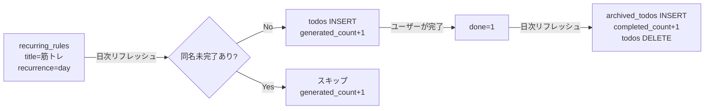

# ER図（データベース構造）

## 全体ER図

```mermaid
erDiagram
    users ||--o{ todos : owns
    users ||--|| user_settings : has
    users ||--o{ work_logs : via_todo
    users ||--o{ archived_todos : archives
    users ||--o{ recurring_rules : manages
    users ||--o{ todo_categories : defines
    users ||--o{ diary_entries : writes
    users ||--o{ task_sets : owns
    users ||--o{ bucket_list : owns
    users ||--o{ bucket_categories : defines
    users ||--o{ matrix_positions : saves
    users ||--o{ bug_reports : submits
    users ||--o| user_purchases : has_pro

    todos ||--o{ work_logs : logs
    todos }o--o| todos : parent_id

    task_sets ||--o{ task_set_items : contains
    task_sets ||--o{ task_set_likes : liked_by

    diary_entries ||--o{ diary_replies : has
    diary_entries ||--o{ diary_likes : liked_by

    bucket_categories ||--o{ bucket_list : categorizes
    bucket_shares ||--|| users : shared_by

    users {
        TEXT id PK
        TEXT name
        TEXT email UK
        TEXT password_hash
        TEXT role "user or admin"
        TEXT last_refresh_date "YYYY-MM-DD"
        TEXT birthday
        TEXT avatar
        INTEGER created_at
    }

    user_settings {
        TEXT user_id PK_FK
        INTEGER dark_mode
        INTEGER font_size
        TEXT font_family
        TEXT butler_avatar
        TEXT butler_prompt
        INTEGER butler_max_chars
        TEXT welcome_tone
        INTEGER show_butler
        INTEGER pomodoro_work
        INTEGER pomodoro_break
        TEXT timezone
        INTEGER timeblock_start
        INTEGER timeblock_end
    }

    todos {
        TEXT id PK
        TEXT user_id FK
        TEXT parent_id FK
        TEXT title
        INTEGER est_min
        INTEGER actual_min
        REAL stuck_hours
        INTEGER last_worked_at
        INTEGER deadline
        TEXT recurrence
        TEXT detail
        TEXT category
        INTEGER started
        INTEGER done
        INTEGER sort_order
        TEXT gtd_status
        INTEGER created_at
    }

    work_logs {
        TEXT id PK
        TEXT todo_id FK
        TEXT content "+N分 メモ形式"
        TEXT date "YYYY-MM-DD"
        INTEGER created_at
    }

    archived_todos {
        TEXT id PK
        TEXT user_id FK
        TEXT title
        INTEGER est_min
        INTEGER actual_min
        TEXT detail
        TEXT category
        INTEGER deadline
        INTEGER done
        INTEGER created_at
        INTEGER archived_at
    }

    recurring_rules {
        TEXT id PK
        TEXT user_id FK
        TEXT title
        INTEGER est_min
        TEXT detail
        TEXT recurrence
        TEXT category
        INTEGER deadline_offset_days
        INTEGER enabled
        INTEGER generated_count
        INTEGER completed_count
        INTEGER created_at
    }

    todo_categories {
        TEXT id PK
        TEXT user_id FK
        TEXT name
        INTEGER sort_order
        INTEGER created_at
    }

    task_sets {
        TEXT id PK
        TEXT user_id FK
        TEXT name
        INTEGER is_public
        INTEGER created_at
    }

    task_set_items {
        TEXT id PK
        TEXT set_id FK
        TEXT parent_id
        TEXT title
        INTEGER est_min
        TEXT detail
        TEXT recurrence
        TEXT deadline
        INTEGER sort_order
    }

    task_set_likes {
        TEXT id PK
        TEXT set_id FK
        TEXT user_id FK
    }

    diary_entries {
        TEXT id PK
        TEXT user_id FK
        TEXT title
        TEXT date
        TEXT content
        INTEGER is_public
        INTEGER created_at
        INTEGER updated_at
    }

    diary_replies {
        TEXT id PK
        TEXT diary_id FK
        TEXT user_id FK
        TEXT content
        INTEGER created_at
    }

    diary_likes {
        TEXT id PK
        TEXT diary_id FK
        TEXT user_id FK
    }

    matrix_positions {
        TEXT id PK
        TEXT user_id FK
        TEXT name
        TEXT positions_json
        INTEGER created_at
    }

    bucket_list {
        TEXT id PK
        TEXT user_id FK
        TEXT title
        TEXT detail
        TEXT category
        INTEGER deadline_year
        INTEGER done
        INTEGER sort_order
        INTEGER created_at
    }

    bucket_categories {
        TEXT id PK
        TEXT user_id FK
        TEXT name
        INTEGER sort_order
    }

    bucket_shares {
        TEXT id PK
        TEXT user_id FK
        TEXT share_token UK
        INTEGER created_at
    }

    user_purchases {
        TEXT id PK
        TEXT user_id FK_UK
        TEXT stripe_session_id
        INTEGER purchased_at
    }

    bug_reports {
        TEXT id PK
        TEXT user_id FK
        TEXT user_name
        TEXT title
        TEXT description
        TEXT status
        TEXT admin_reply
        INTEGER created_at
        INTEGER updated_at
    }

    password_reset_tokens {
        TEXT id PK
        TEXT user_id FK
        TEXT token UK
        INTEGER expires_at
    }
```

## インデックス一覧

パフォーマンス向上のため以下のインデックスを設定:

| インデックス名 | テーブル | カラム | 用途 |
|---|---|---|---|
| `idx_todos_user_id` | todos | user_id | ユーザーのタスク一覧取得 |
| `idx_todos_user_id_done` | todos | user_id, done | 完了/未完了フィルタ |
| `idx_work_logs_todo_id` | work_logs | todo_id | タスクの作業ログ取得 |
| `idx_diary_entries_user_id_date` | diary_entries | user_id, date DESC | 日記一覧 |
| `idx_diary_entries_public` | diary_entries | is_public, date DESC | 公開日記フィード |
| `idx_diary_replies_diary_id` | diary_replies | diary_id | リプライ取得 |
| `idx_diary_likes_diary_id` | diary_likes | diary_id | いいね数集計 |
| `idx_archived_todos_user_id` | archived_todos | user_id, archived_at DESC | アーカイブ一覧 |
| `idx_recurring_rules_user_id_enabled` | recurring_rules | user_id, enabled | 有効な繰り返しルール |
| `idx_todo_categories_user_id` | todo_categories | user_id | カテゴリ一覧 |
| `idx_bucket_list_user_id` | bucket_list | user_id, done, sort_order | やりたいことリスト |
| `idx_task_sets_user_id` | task_sets | user_id | タスクセット一覧 |
| `idx_task_set_items_set_id` | task_set_items | set_id | セット内アイテム |

## データ保持ポリシー

| データ | 保持期間 | 備考 |
|---|---|---|
| todos | 完了まで | 完了時にarchived_todosへ移動 |
| archived_todos | 最新100件/ユーザー | 古いものは自動削除 |
| work_logs | 無期限 | 削除されない |
| diary_entries | 無期限 | 削除されない |
| recurring_rules | 無効化まで | DELETEは `enabled=0` にするだけ |
| password_reset_tokens | expires_at まで | 期限切れは自動削除されない（TODO） |

## 繰り返しルールとタスクの関係


