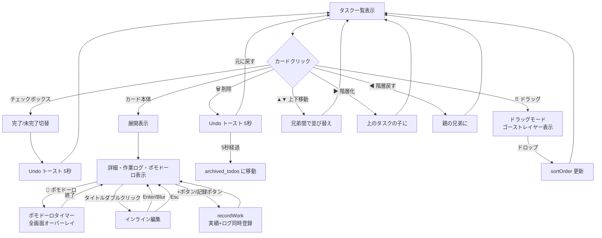
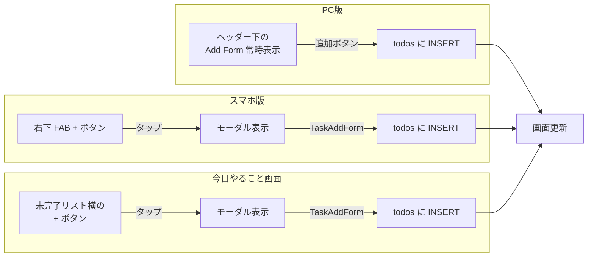
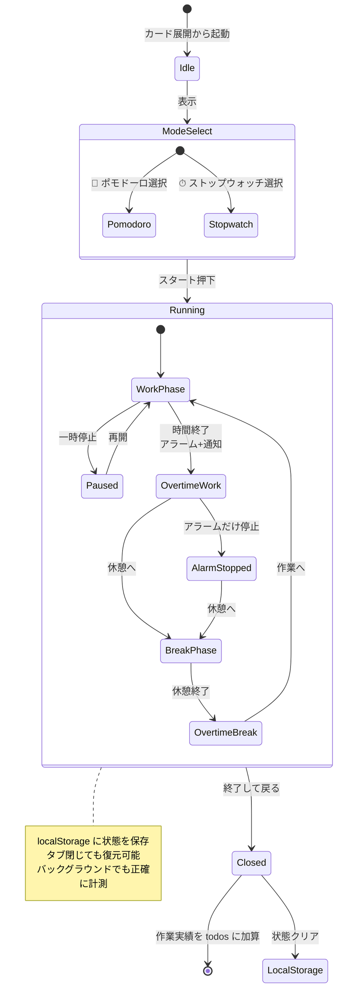
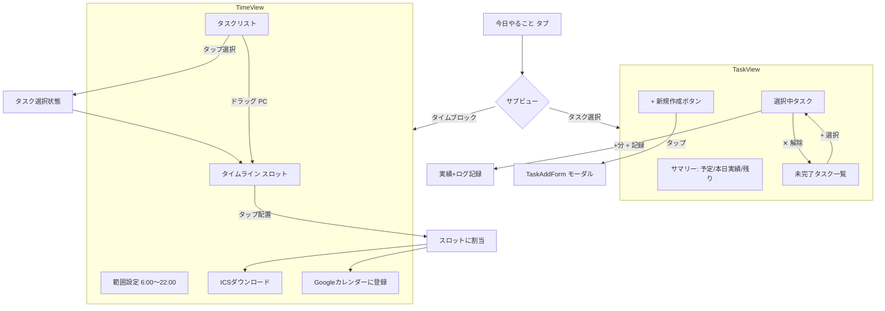
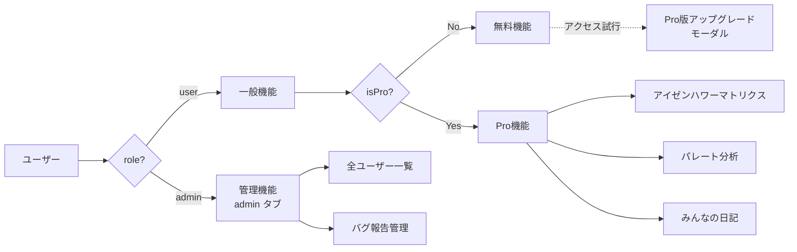

# 画面遷移図

## 全体フロー

```mermaid
flowchart TB
    Start([アプリ起動]) --> AuthCheck{ログイン済み?}

    AuthCheck -->|No| Login[ログイン画面]
    AuthCheck -->|Yes| Welcome[Welcome メッセージ<br/>3秒表示]

    Login -->|新規登録タブ| Register[新規登録画面]
    Register -->|登録完了| Welcome
    Login -->|パスワード忘れ| Forgot[パスワード再設定<br/>/forgot-password]
    Forgot --> Reset[/reset-password]
    Reset --> Login

    Login -->|認証成功| Welcome
    Welcome --> Home[タスク画面<br/>activeTab=tasks]

    Home --> Menu{ハンバーガーメニュー}

    Menu -->|タスク管理| TaskGroup
    Menu -->|記録| RecordGroup
    Menu -->|日記| DiaryGroup
    Menu -->|アカウント| AccountGroup
    Menu -->|サポート| SupportGroup

    subgraph TaskGroup [タスク管理]
        Home2[タスク tasks]
        Today[今日やること today]
        Calendar[カレンダー calendar]
        TaskSets[タスクセット task-sets]
        Matrix[マトリクス matrix 🔒Pro]
        GTD[GTD gtd]
        Recurring[繰り返し recurring]
        Bucket[やりたいこと bucket-list]
        Archived[削除タスク archived]
    end

    subgraph RecordGroup [記録]
        Activity[作業記録 activity]
        Analytics[分析 analytics]
        CategoryStats[カテゴリ別実績 category-stats]
    end

    subgraph DiaryGroup [日記]
        DiaryWrite[書く diary-write]
        DiaryView[履歴 diary-view]
        DiaryPublic[みんなの日記 diary-public 🔒Pro]
    end

    subgraph AccountGroup [アカウント]
        MyPage[マイページ mypage]
        Settings[設定 settings]
    end

    subgraph SupportGroup [サポート]
        Help[ヘルプ help]
        BugReport[バグ報告 bug-report]
        Admin[管理 admin 👑管理者のみ]
    end

    Home -.->|ログアウト| Login
```

---

## タブ切替フロー（ログイン後）

```mermaid
stateDiagram-v2
    [*] --> tasks
    state tasks {
        [*] --> detail
        detail --> compact : ≡ 押下
        compact --> grid : ⊞ 押下
        grid --> kanban : ☰☰ 押下
        kanban --> detail : ☰ 押下
    }

    state today {
        [*] --> TaskSelect
        TaskSelect --> TimeBlock : タブ切替
        TimeBlock --> TaskSelect : タブ切替
    }

    state activity {
        [*] --> list
        list --> stats : 📊
        stats --> chart : 📈
        chart --> pareto : 📐 🔒Pro
        pareto --> list
    }

    state analytics {
        [*] --> estimation
        estimation --> burndown
        burndown --> weekly
        weekly --> estimation
    }

    state gtd {
        [*] --> inbox
        inbox --> next_action
        next_action --> waiting
        waiting --> someday
        someday --> inbox
    }

    tasks --> today
    today --> calendar
    calendar --> recurring
    recurring --> task-sets
    task-sets --> matrix
    matrix --> gtd

    tasks --> activity
    activity --> analytics
    analytics --> category-stats

    tasks --> diary-write
    diary-write --> diary-view
    diary-view --> diary-public

    tasks --> bucket-list
    tasks --> mypage
    tasks --> settings
    tasks --> help
    tasks --> bug-report
```

---

## タスク操作フロー（tasks タブ内）



---

## タスク追加フロー



---

## ポモドーロタイマー遷移



---

## 今日やること画面（サブビュー）



---

## タブバー配置（レスポンシブ）

### PC版

```
┌─────────────────────────────────────────────┐
│ [タイトル]   [ユーザー名] [ログアウト] [☰]   │
├─────────────────────────────────────────────┤
│ [タスク][今日][カレンダー][セット][繰り返し] │ ← diaryModeBar（該当タブのみ）
├─────────────────────────────────────────────┤
│                                              │
│          メインコンテンツ                     │
│                                              │
└─────────────────────────────────────────────┘
```

### スマホ版

```
┌────────────────────────┐
│ [タイトル]          [☰]│
├────────────────────────┤
│                        │
│   メインコンテンツ      │
│                        │
│                  [＋FAB]│ ← tasksタブのみ
├────────────────────────┤
│[タスク][日記][記録][My][☰]│ ← ボトムタブバー
└────────────────────────┘
```

---

## モーダル・オーバーレイ一覧

| 名前 | 起動条件 | 閉じる方法 |
|---|---|---|
| **ハンバーガーメニュー** | ☰ タップ | 外側タップ or メニュー項目選択 |
| **スマホ追加モーダル** | FAB + タップ | × or 外側タップ |
| **タスク新規作成モーダル**（今日やること） | + タップ | × or 外側タップ |
| **ポモドーロタイマー** | 🍅 ポモドーロ開始 | 終了して戻る |
| **Pro版アップグレード** | Pro機能アクセス（未購入） | × or 購入 |
| **チュートリアル吹き出し** | ヘルプのハンズオン開始 | ← ハンズオンに戻る |
| **Undoトースト** | 削除/完了切替 | 元に戻す or 5秒自動消滅 |
| **やりたいことリスト削除確認** | 削除ボタン | 元に戻す or 5秒経過 |

---

## 権限によるアクセス制御


