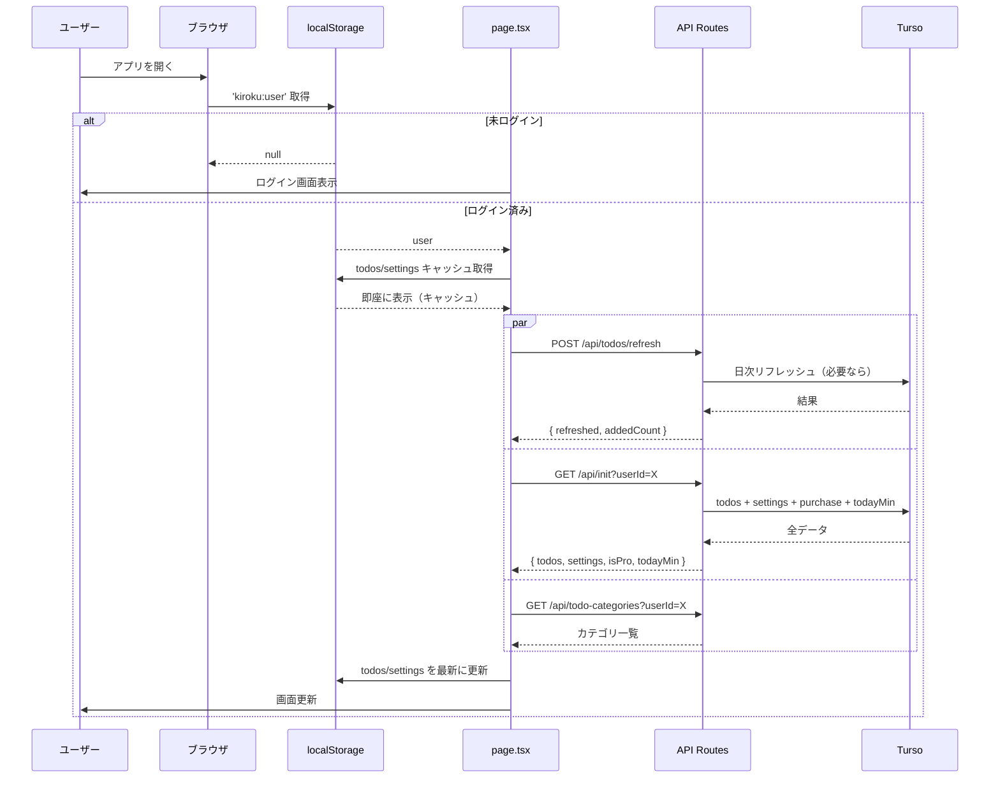
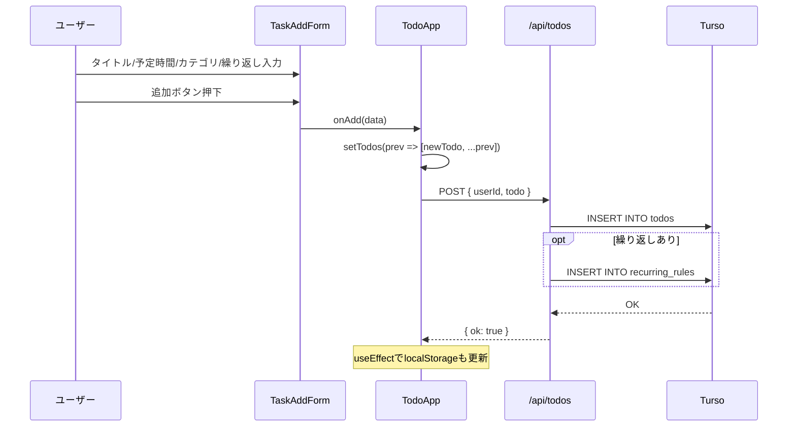
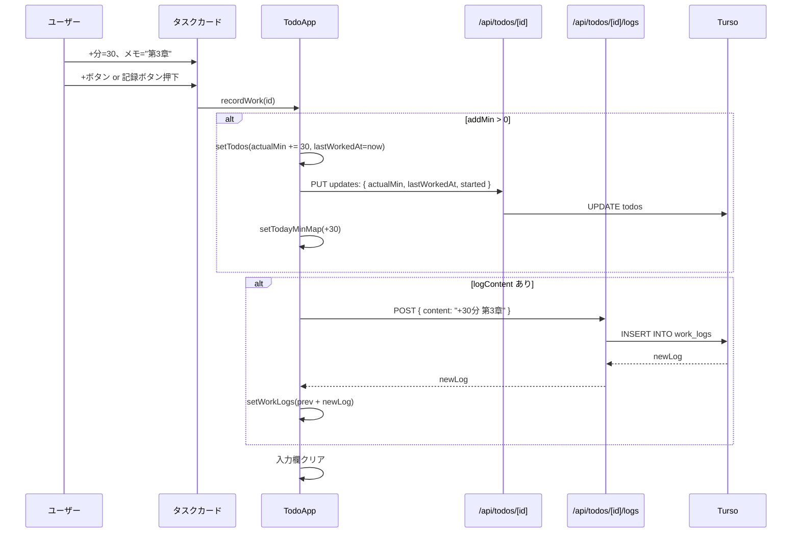
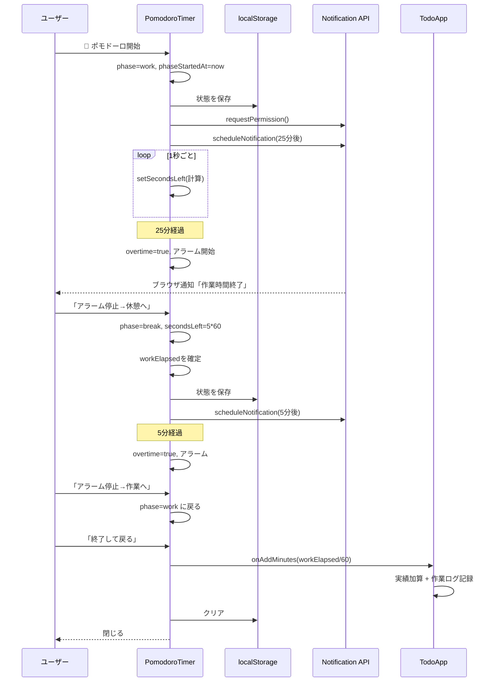
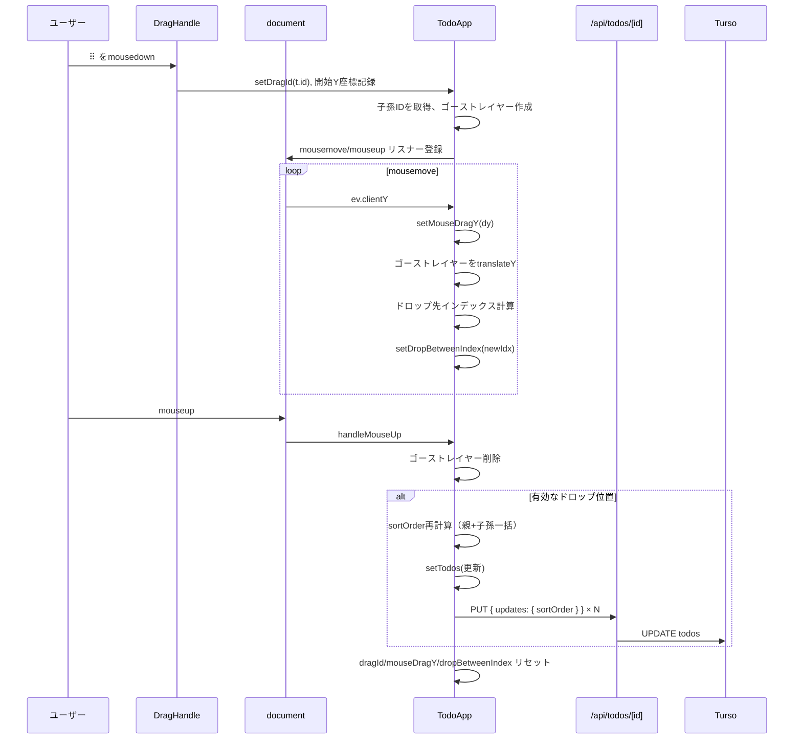
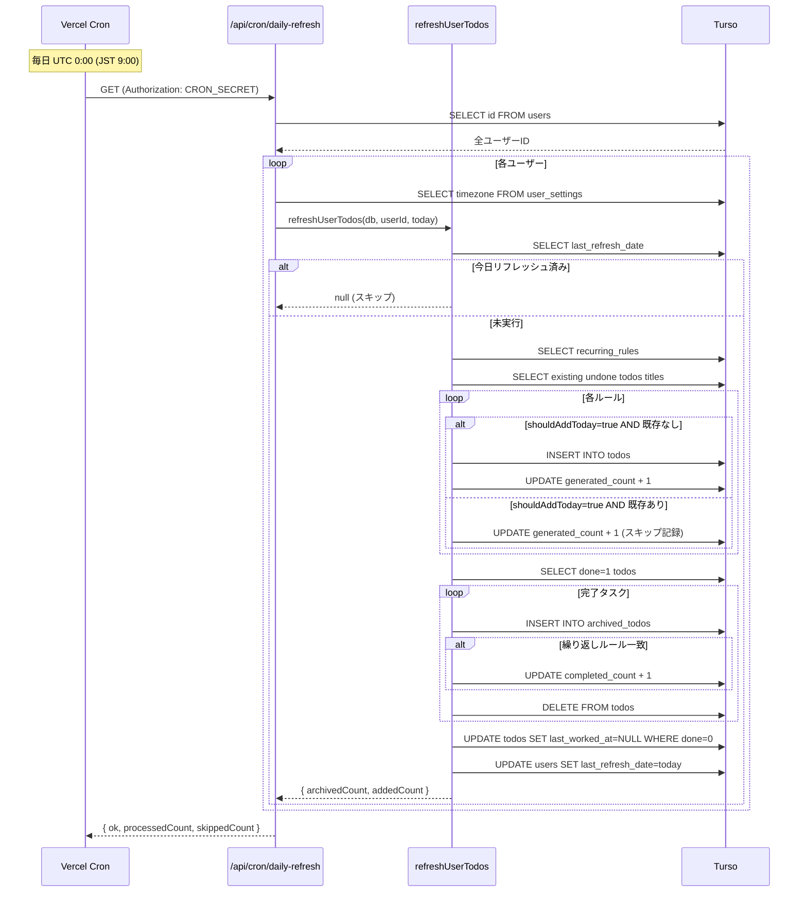
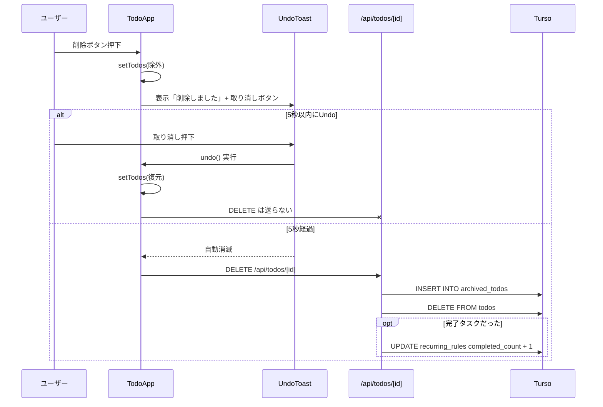
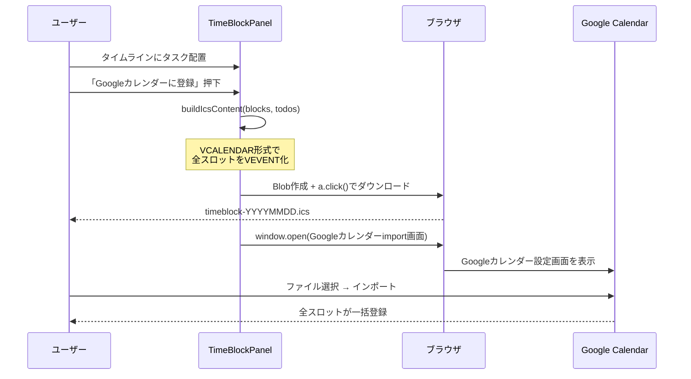
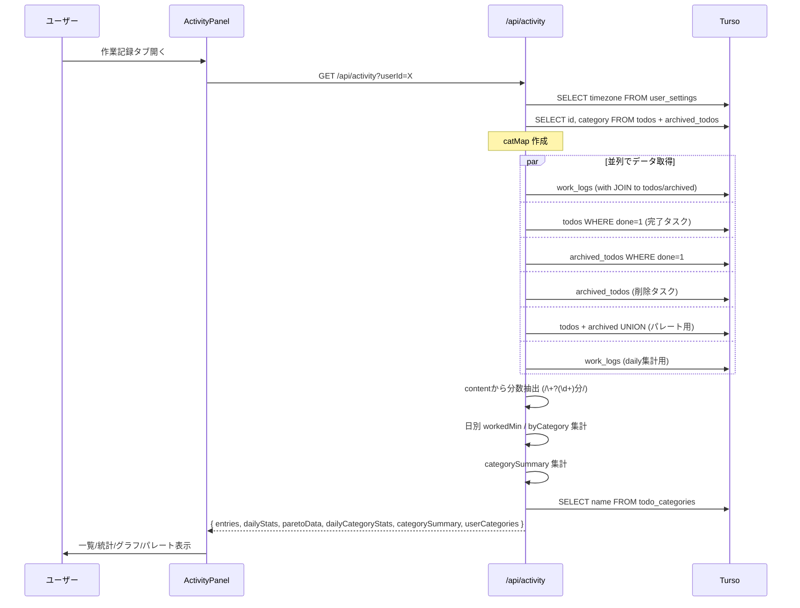
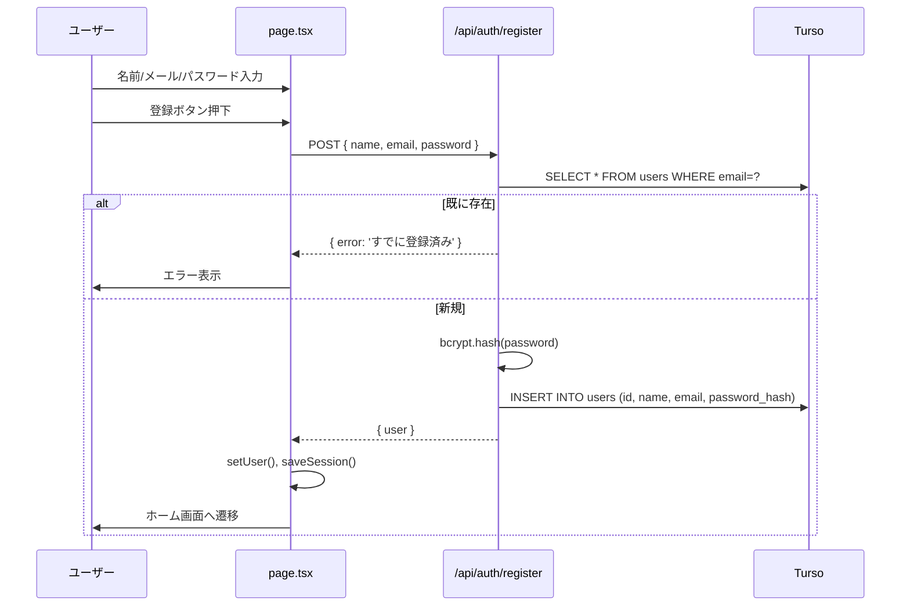

# シーケンス図

主要ユースケースの処理フローを図示します。

---

## 1. 初期ロード（ログイン済みユーザー）

---

## 2. タスク追加

---

## 3. 実績時間+作業ログの同時記録（recordWork）

---

## 4. ポモドーロタイマー（作業→休憩サイクル）

---

## 5. タスクドラッグによる並び替え（PC版）

---

## 6. 日次リフレッシュ（Vercel Cron）

---

## 7. タスク削除（Undoトースト）

---

## 8. カレンダーへのタイムブロック一括エクスポート

---

## 9. 作業記録ページの閲覧

---

## 10. ユーザー認証（新規登録）

